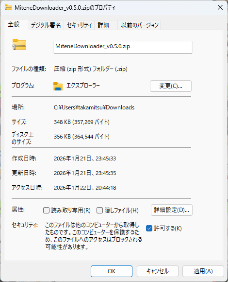

# MiteneDownloader
みてねから写真・動画をダウンロード

個人用に作ったWindows用ソフトを公開

## ソフト入手
- [Release](https://github.com/kitamux68k/MiteneDownloader/releases)ページからMiteneDownloader_vx.x.x.zipをダウンロードする。
- zipファイルを右クリック＞プロパティをクリックし、セキュリティ＞許可するのチェックボックスにチェックを入れてOKをクリック。
  
  
- zipファイルを展開する。

## 使用方法
1. 事前準備：「みてねブラウザ版」のアドレスを使用するため、みてねアプリから「家族設定」->「家族一覧」->「家族を招待する」->「ブラウザ版で招待」でアドレスを作成する。
2. アドレス：ダウンロードしたい「みてねブラウザ版」のアドレスを入力
3. パスワード：パスワードをかけている場合は、パスワード欄に入力
4. 保存先：ダウンロードしたファイルの保存先を選択
5. 実行ボタンをクリック

## 仕様
- ファイル名（下記のnnnミリ秒部分はみてね上に情報が無いと思われる。ファイル名の重複を避けるためIDの一部を流用）
  - 写真：IMG_yyyyMMdd_HHmmssnnn.jpg
  - 動画：MOV_yyyyMMdd_HHmmssnnn.mp4
- ダウンロード間隔：4秒
- お試し版：ダウンロード100件まで。
